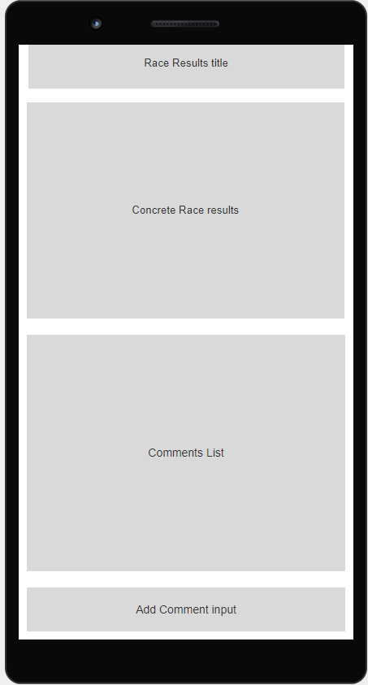

# F1 kalendár

# Specifikáció

Az alkalmazás lehetőséget ad a felhasználóknak egy android applikáción keresztül, hogy megtekintsenek információkat az eddigi összes forma 1-es versenyről. Ezen versenyek között megtalálhatóak a már meghatározott versenyidőpontok (aktuális szezon versenyei), és a korábbi szezonok is. A versenyek az applikáció elindításakor egy listában jelennek meg, melyeknek az about gombjára nyomva lehet megtekinteni a verseny részleteihez tartozó információkat. A részletek oldalon megtekinthető a versenyhez tartozó információk (mint ország, város, szezon, verseny sorszám), továbbá az időpontokat, amik az eseményhez tartoznak és abban az esetben, ha a verseny már megtörtént akkor a dobogós versenyzők. A felhasználónak továbbá lehetősége van az egyes versenyekhez saját megjegyzést fűzni, és törölni.

## Usecase

## Részletek

A rendszernek egyetlen actor-a van, mivel az alkalmazás fő funkciója az információ szolgáltatás 
felhasználói fiókok nélkül. A user story-k pedig a következőek a use-case alapján:

| id | Actor | Leírás |
|----|-------|--------|
| 1 | User | Egy listában megnézi a még nem megrendezett versenyeket |
| 2 | User | Egy listában megnézi a már megrendezett nagydíjakat |
| 3 | User | A lista egy elemére kattintva átkerül a részletek nézetre|
| 4 | User | Megtekinti a verseny részletei (ország, város, menetrend)|
| 5 | User | Megtekinti a dobogós versenyzőket a már lezajlott versenyről|
| 6 | User | Megtekinti a dobogós versenyzőket a már lezajlott versenyről|
| 7 | User | Megtekinti a dobogós versenyzőket a már lezajlott versenyről|
| 8 | User | Kommentet töröl egy versenyről|

## Wireframes

### Content

HomeScreen:

DetailsView: 

### Lo-fi

HomeScreen:

DetailsView: 

# Skeleton

## Workflow: 

A labor során létrehoztam egy új branch-et a már meglévő repo-mhoz amit a release/lab2-nek neveztem, ebben a repositoryba kerülnek az egyes feature branch-ek miután a funkció implementálva lettek és lesz össze merge-elve a main-el. A tervezés során a következő feature barnch-eket hoztam létre: 

- CI: Az android CI megírása és beüzemelése 
- Skeleton: ahol magát a project-et inicializálom és adom hozzá az egyes később szükséges file-okat 

Az git log ennek megfelelően a következő képpen néz ki a main-be merge-elés előtt:

A merge-elés után a CI futási eredménye a következő: 

